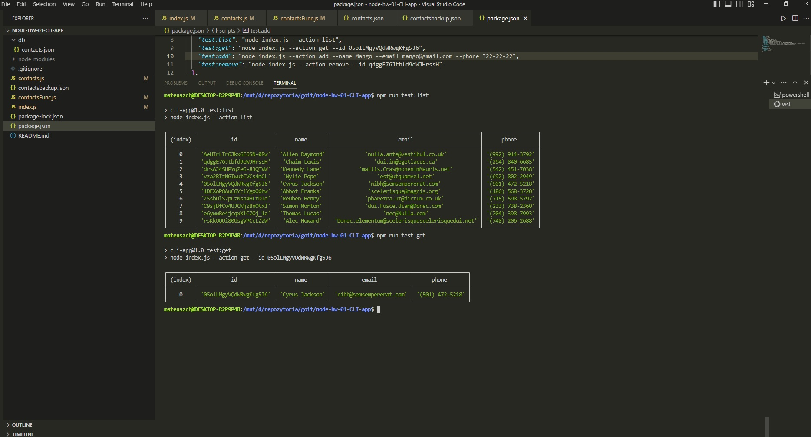
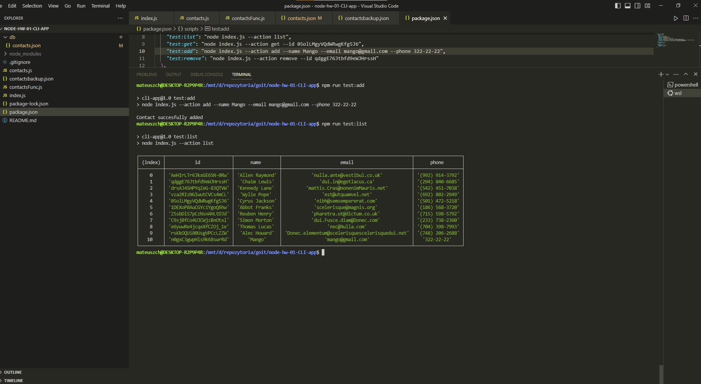
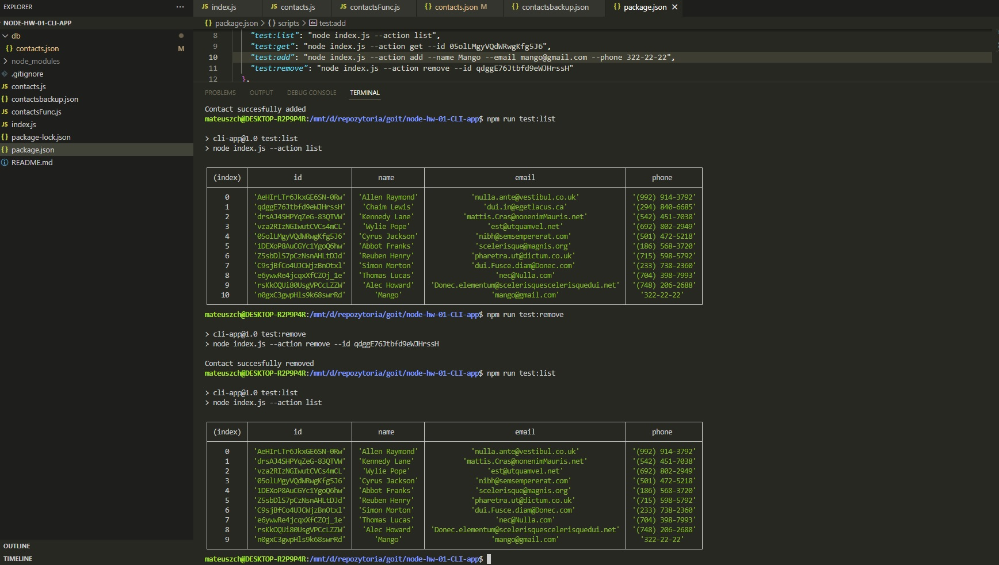

# node-hw-01-CLI-app

The following things were given:

`contacts.json`, [Backend](https://connections-api.herokuapp.com/docs/). `destinated routing`

Libraries - [Commmander](https://www.npmjs.com/package/commander), [nanoid](https://www.npmjs.com/package/nanoid)

## Task

To get list of contacts from `contacts.json` or get single contact by contact `id`:

To add contact to list of contacts in`contacts.json`:

To remove contact from list of contacts in`contacts.json`:
